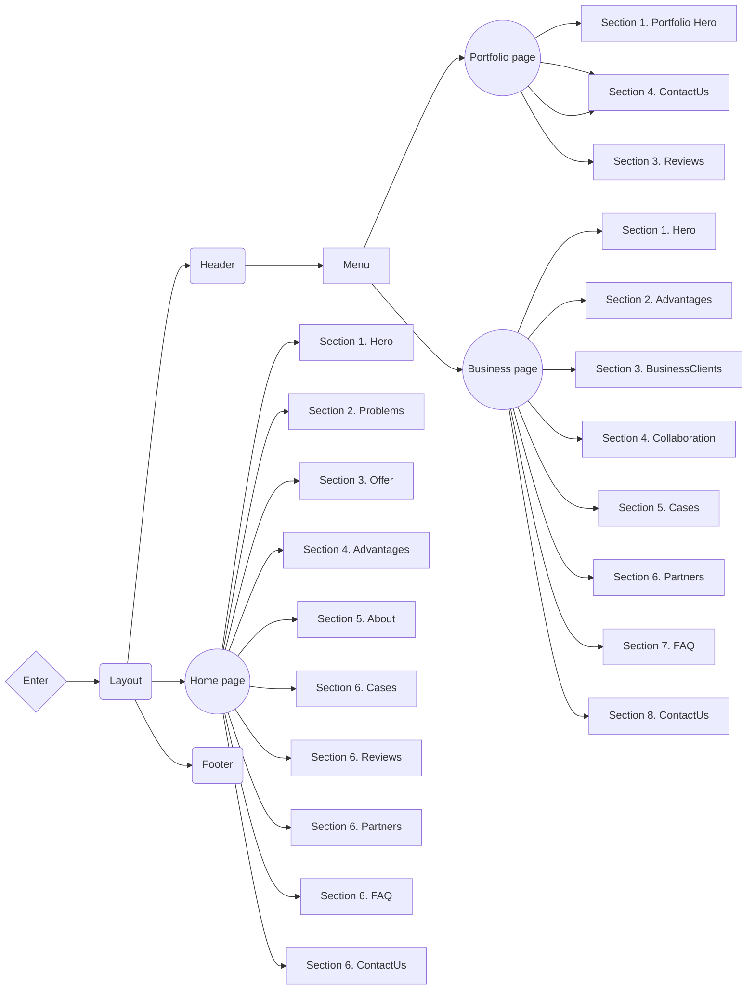

# SPILNO 💻🧩👨🏿‍💻

**[View live page](https://spilno.vercel.app/)**

---


## 🗂️ Project description 🗂️

A website for the **Spilno** website development company.

- **Project name**: Spilno
- **Project goals**:
  - Develop websites for your business for free.
  - Promotes the education and development of young professionals.
  - Provides an opportunity for businesses to cooperate with talented students.
  - Attracting new client / partners
- **Target audience**:
  - **Age**: 18-50+
  - **Gender**: All
- **Product scope**: Development of a multi-page website for the SoftRyzen
  company, whose main field of activity is web-developing

## ⚙️ Creating the project ⚙️

**Spilno** is a [Next.js](https://nextjs.org/) project bootstrapped with
[`create-next-app`](https://github.com/vercel/next.js/tree/canary/packages/create-next-app).

### Features

- **Optimization**: The website is optimized for fast loading, providing users
  with quick access to information.
- **Modularity and reusability**: The product is built using a component
  approach, which makes the code modular and allows components to be used on
  different pages and in different sections of the project. This simplifies the
  maintenance of the site and the expansion of its functionality.
- **Linters and formatting**: Using tools like Prettier and ESLint helps
  maintain code standards, ensures a consistent style, and identifies potential
  problems in the code.
- **Adaptability**: The website is responsive, allowing you to create dynamic
  and interactive user interfaces without reloading pages. This increases user
  engagement and interaction.
- **Convenient content management**: The content management system has an
  intuitive interface that simplifies the process of updating and editing
  content. You can easily make changes to texts, images and other content
  without special knowledge in web development.
- **Accessibility**:
  - Intuitive design
  - Semantic HTML
  - Mobile-friendly interface
  - Web resource available for any internet connection

### Design

[Design layout on Figma](https://www.figma.com/file/mSm6uF73qFf4q1R87z63jl/Site?type=design&node-id=1830-7598&mode=design&t=HuwLqtzF5dy9YXKM-0)

### Project structure



<details>

<summary><b>Project Organization and File Colocation: </b></summary>

<br/>

```

|-- public -> static files
|-- src -> source directory with the main application code
  |-- app -> pages and routing
    |-- / --> routing group for main UI
    |-- (portfolio) --> routing group for portfolio UI
    |-- (business) --> routing group for business UI
  |-- components -> folder with reusable components
    |-- base -> base sections/block components (accordion, form, slider, etc.)
    |-- ui -> small reusable components (button, modal, etc.)
      |-- NameComponent -> folders for each component
        |-- NameComponent.tsx -> main component
        |-- NameComponent.module.css -> file for special components styles
        |-- index.ts -> file for re-export
        |-- types.ts -> file for special components types (props)
  |-- layout -> components that are used as a main template (header, footer)
  |-- sections -> folder with section components
  |-- data -> static data for the project (json)
  |-- types -> folder with reusable type definitions
  |-- utils -> additional reusable functions

```

</details>

### Components API

Each component has its own API. You can find it in the component's folder. This
is a list of more common components and their API.

- #### Logo

| Prop        | Default | Description                                                    |
| ----------- | ------- | -------------------------------------------------------------- |
| `location`  | -       | required, choose the position you'd need :'header' or 'footer' |
| `className` | ''      | optional, `string`, adds custom css class.                     |

- #### MainNav

| Prop       | Default   | Description                                                  |
| ---------- | --------- | ------------------------------------------------------------ |
| `location` | -         | required, choose the position you'd need :'header' or 'menu' |
| `onClick`  | undefined | click handler                                                |

- #### SectionTitle

| Prop         | Default | Description                                                  |
| ------------ | ------- | ------------------------------------------------------------ |
| `children`   | -       | required, `ReactNode`.                                       |
| `isWhite`    | `false` | optional, `boolean`, changes color to white.                 |
| `isCentered` | `false` | optional, `boolean`, adds css property `text-align: center`. |
| `className`  | ''      | optional, `string`, adds custom css class.                   |

- #### ModalBtn

| Prop            | Default   | Description                                                   |
| --------------- | --------- | ------------------------------------------------------------- |
| `location`      | -         | required, choose the position you'd need :'header' or 'modal' |
| `ariaLabel`     | -         | required, text for the aria label                             |
| `onClick`       | undefined | optional, click handler                                       |
| `className`     | ''        | optional, add custom or additional css class you'd need.      |
| `iconClassName` | ''        | optional, add custom or additional css class you'd need.      |

- #### Modal

Pure Modal Component which expect `onClose`:implements close modal window by
mouse click on backdrop or by press `ESC` button, `isOpen` - state to show/hide
modal, `children` -content for modal.

| Prop             | Default | Description                                                       |
| ---------------- | ------- | ----------------------------------------------------------------- |
| `children`       | -       | required, `ReactNode`, which will be content for modal window     |
| `isOpen`         | `false` | required, `boolean`, changes state to show/close the window.      |
| `onClose`        | -       | required, click handler for close modal window                    |
| `modalStyle`     | ''      | optional, `string`, additional css class you'd need               |
| `modalWrapStyle` | ''      | optional, `string`, additional css class you'd need for container |
| `backdropStyle`  | ''      | optional, `string`, additional css class you'd need               |

- #### RingedImage

Rounded Image component `rounded-full` expect Next/Image component as children
prop with fill prop. Contains pseudo after element `ring`, positioned absolutely
looks as `2px white` border. Component expect `right` or `left` variants for
position the ring. With option `hero` for prop `ringType` realized special ring
`3px '#BFD5FF'` border, setup in config colors as heroRing.

| Prop        | Default | Description                                                                                   |
| ----------- | ------- | --------------------------------------------------------------------------------------------- |
| `children`  | -       | required, `ReactNode`, expect Image component with fill property                              |
| `variant`   | -       | required, select the ring positioning option: `right` or `left`                               |
| `ringType`  | ``      | optional, realized ring `3px '#BFD5FF'` border for Hero Component                             |
| `className` | ''      | optional, `string`, You should set the width of component and additional css class you'd need |

- #### Button

A button or link component. Can accept an SVG icon component as children. The
`link` prop enables the link mode, the value of which will be used in the href
tag from NextLink. Props `text` - the text that will be displayed in the button
or link. `btnStyle` sets the style of the stylized button, has the following
options: `primary`, `accent`, `submit`, `transparent`. `className` is a prop
that can be used to pass styles that will override common button or link styles

| Prop        | Default     | Description                                                                              |
| ----------- | ----------- | ---------------------------------------------------------------------------------------- |
| `link`      | `undefined` | `string` or `undefined` toggles changes the button tag to a link tag, the value must     |
|             |             | contain a site link or section ID.                                                       |
| `text`      | `undefined` | required, `string`, the text displayed in the button                                     |
| `children`  | `undefined` | ReactNode embedded components                                                            |
| `btnStyle`  | `primary`   | sets the type of stylization, can be: `primary` or `accent` or `submit` or `transparent` |
| `className` | `undefined` | `string`, allows you to override common styles                                           |

- #### Slider

| Prop             | Default     | Description                                                                                               |
| ---------------- | ----------- | --------------------------------------------------------------------------------------------------------- |
| `slideComponent` | -           | required, `React.FC<any>`, It`s the component that will be rendered as side.                              |
| `slidesData`     | -           | required, `Record<string, any>[]`, It is a array with slide`s objects                                     |
| `section`        | -           | required, `cases`, `reviews`, `partners`, `advantages`, name of the section where slider will be rendered |
| `wrapClassName`  | `undefined` | optional, `string`, adds custom css class to the Swiper component.                                        |
| `slideClassName` | `undefined` | optional, `string`, adds custom css class to the SlideComponent component.                                |

- #### SliderControls

| Prop            | Default     | Description                                                                                            |
| --------------- | ----------- | ------------------------------------------------------------------------------------------------------ |
| `section`       | -           | required, `cases`, `reviews`, `advantages`, name of the section where sliderControls will be rendered. |
| `wrapClassName` | `undefined` | optional, `Record<string, any>[]`, adds custom css class on the div that wraps control buttons.        |

- #### Accordion

The accordion component takes the accordion element component as children, and
stores the state of the element. By default, the first element has an expanded
state. Only one item can be deployed at a time

| Prop        | Default     | Description                                                                   |
| ----------- | ----------- | ----------------------------------------------------------------------------- |
| `children`  | `undefined` | required, Built-in ReactNode components, an accordion element                 |
| `type`      | `undefined` | optional, specifies the type of component to render and progress as children  |
| `className` | `undefined` | optional, `string`, adds custom css class to the Accordion wrapper component. |

- #### AccordionOfferItem

Component is an accordion element that contains a title, description, and image

| Prop    | Default     | Description                                                                                                                         |
| ------- | ----------- | ----------------------------------------------------------------------------------------------------------------------------------- |
| `data`  | `undefined` | data to be displayed in the component must contain a `title`:`string`, `description`:`string`, `image`:`string` - path to the image |
| `index` | `undefined` | `number`, the index of the expanded element                                                                                         |
| `aria`  | `undefined` | `string`, text to fill the aria label for the icon                                                                                  |

- #### AccordionFAQItem

Component is an accordion element that contains a question and answer.

| Prop    | Default     | Description                                                                                  |
| ------- | ----------- | -------------------------------------------------------------------------------------------- |
| `data`  | `undefined` | data to be displayed in the component must contain a `question`:`string`, `answer`:`string`, |
| `index` | `undefined` | `number`, the index of the expanded element                                                  |
| `aria`  | `undefined` | `string`, text to fill the aria label for the icon                                           |

- #### ReviewCard

The component is a feedback card. Implements card rendering with text feedback
and video feedback. In order for the video display mode to be enabled, the video
props must be set to true.

| Prop     | Default     | Description                                          |
| -------- | ----------- | ---------------------------------------------------- |
| `text`   | `undefined` | required, `string`, or `null` text feedback          |
| `video`  | `undefined` | required, `Object`, or `null` video feedback data    |
| `author` | `undefined` | required, `Object`, data of the author of the review |
| `type`   | `undefined` | required, `string`, feedback type, video or text     |

- #### ReviewerInfoCard

The component is a feedback card. Implements card rendering with text feedback
and video feedback. In order for the video display mode to be enabled, the video
props must be set to true.

| Prop            | Default     | Description                                                                          |
| --------------- | ----------- | ------------------------------------------------------------------------------------ |
| `author`        | `undefined` | required, `Object`, author data                                                      |
| `isVideoReview` | `undefined` | required, `boolean`, indicates whether it is a video review or a text one.           |
| `className`     | `undefined` | optional, `string`, adds custom css class to the ReviewerInfoCard wrapper component. |

- #### Tabs

A component that allows playing different content depending on which button is
active. Depending on the data passed, the corresponding tab component will be
displayed.

| Prop            | Default     | Description                                                           |
| --------------- | ----------- | --------------------------------------------------------------------- |
| `reviewsData`   | `undefined` | required, `Object`, data required for rendering reviews               |
| `questionsData` | `undefined` | required, `Object`, data required for rendering questions and answers |
| `children`      | `undefined` | required, Built-in ReactNode components                               |

- #### FormField

This is a styled input component with an accompanying label and FormError.

| Prop          | Default     | Description                                                                       |
| ------------- | ----------- | --------------------------------------------------------------------------------- |
| `label`       | `undefined` | required, `string`, label value                                                   |
| `type`        | `undefined` | required, `string`, input type                                                    |
| `placeholder` | `undefined` | required, `string`, input placeholder                                             |
| `name`        | `undefined` | required, `string`, input name                                                    |
| `register`    | `undefined` | required, `func` register onChange, onBlur, name, validation from React Hook Form |
| `errors`      | `undefined` | required, errors `object` from React Hook Form.                                   |
| `required`    | `undefined` | required, `boolean` sets the label as required or optional.                       |
| `className`   | `""`        | optional, `string`, allows you to override common styles                          |

- #### FormPhoneField

This is a styled textarea component with an accompanying label and FormError tha
formatt numeric input according pattern.

| Prop          | Default     | Description                                                                                 |
| ------------- | ----------- | ------------------------------------------------------------------------------------------- |
| `label`       | `undefined` | required, `string`, label value                                                             |
| `placeholder` | `undefined` | required, `string`, input placeholder                                                       |
| `name`        | `undefined` | required, `string`, textarea name                                                           |
| `control`     | `undefined` | required, `object` object contains methods for registering components into React Hook Form. |
| `errors`      | `undefined` | required, errors `object` from React Hook Form.                                             |
| `required`    | `undefined` | required, `boolean` sets the label as required or optional.                                 |
| `className`   | `""`        | optional, `string`, allows you to override common styles                                    |

- #### FormListbox

This is a styled Listbox component (using Listbox @headless library) with an
accompanying label and FormError. Rendered as `button` + open/hide list `ul`

| Prop          | Default     | Description                                                                                 |
| ------------- | ----------- | ------------------------------------------------------------------------------------------- |
| `label`       | `undefined` | required, `string`, label value                                                             |
| `placeholder` | `undefined` | required, `string`, label for button                                                        |
| `name`        | `undefined` | required, `string`, form's element name                                                     |
| `variants`    | `undefined` | required, `string's array`, options to choose                                               |
| `control`     | `undefined` | required, `object` object contains methods for registering components into React Hook Form. |
| `errors`      | `undefined` | required, errors `object` from React Hook Form.                                             |
| `required`    | `undefined` | required, `boolean` sets the label as required or optional.                                 |
| `className`   | `""`        | optional, `string`, allows you to override common styles                                    |

- #### FormTextArea

This is a styled textarea component with an accompanying label and FormError.

| Prop          | Default     | Description                                                                       |
| ------------- | ----------- | --------------------------------------------------------------------------------- |
| `label`       | `undefined` | required, `string`, label value                                                   |
| `placeholder` | `undefined` | required, `string`, textarea placeholder                                          |
| `name`        | `undefined` | required, `string`, textarea name                                                 |
| `register`    | `undefined` | required, `func` register onChange, onBlur, name, validation from React Hook Form |
| `errors`      | `undefined` | required, errors `object` from React Hook Form.                                   |
| `required`    | `undefined` | required, `boolean` sets the label as required or optional.                       |
| `className`   | `""`        | optional, `string`, allows you to override common styles                          |

- #### FormCheckbox

This is a styled checkbox input component with an accompanying label in a form.

| Prop        | Default     | Description                                                                       |
| ----------- | ----------- | --------------------------------------------------------------------------------- |
| `label`     | `undefined` | required, `string`, label value                                                   |
| `name`      | `undefined` | required, `string`, input name                                                    |
| `register`  | `undefined` | required, `func` register onChange, onBlur, name, validation from React Hook Form |
| `errors`    | `undefined` | required, errors `object` from React Hook Form.                                   |
| `ariaLabel` | `undefined` | required, `string`, aria-label value                                              |
| `className` | `""`        | optional, `string`, allows you to override common styles                          |

- #### FormError

This is a styled Error component for form's elements .

| Prop     | Default     | Description                                     |
| -------- | ----------- | ----------------------------------------------- |
| `name`   | `undefined` | required, `string`, input value name            |
| `errors` | `undefined` | required, errors `object` from React Hook Form. |

- #### FormPopup

This popup component rendered using Modal component.

| Prop        | Default | Description                                                              |
| ----------- | ------- | ------------------------------------------------------------------------ |
| `isOpen`    | `false` | required, `boolean`, changes state to show/close the popup.              |
| `isSuccess` | `false` | required, `boolean`, show styled Success or Error component with message |
| `onClose`   | -       | required, click handler for close popup window                           |

- #### AdvantagesCard

Component - card for section company advantages.

| Prop          | Default | Description                                                               |
| ------------- | ------- | ------------------------------------------------------------------------- |
| `id`          | -       | required, `string`, depends what image will be rendered. Value from 01-04 |
| `title`       | -       | required, `string`, will be rendered as card title                        |
| `description` | -       | rrequired, `string`, will be rendered as card description                 |

- #### ReviewModal

Feedback card modal window component. Works in two modes, for test feedback and
video feedback

| Prop            | Default     | Description                                                                             |
| --------------- | ----------- | --------------------------------------------------------------------------------------- |
| `isOpen`        | `undefined` | required, `boolean`, reports the state of the modal window, true - open, false - closed |
| `closeModal`    | `undefined` | required, `function`, callback to close the modal window                                |
| `data`          | `undefined` | required, `Object`, data may include text feedback or video feedback data               |
| `isVideoReview` | `undefined` | required, `boolean`, indicates whether it is a video review or a text one.              |

- #### VideoPlayer

Video player component. Plays videos of different sizes. A link to the video is
expected in the props

| Prop  | Default     | Description                                                 |
| ----- | ----------- | ----------------------------------------------------------- |
| `url` | `undefined` | required, `string`, value of the absolute path to the video |

- #### PartnersCard

Component - card for section company partners.

| Prop  | Default | Description                                         |
| ----- | ------- | --------------------------------------------------- |
| `alt` | -       | required, `string`, describe alt for partner logo   |
| `url` | -       | required, `string`, link with partner web-site logo |

- #### Advantages section

Component - section company's advantages

| Prop    | Default | Description                                            |
| ------- | ------- | ------------------------------------------------------ |
| `id`    | -       | required, `string`, used as id for section             |
| `title` | -       | required, `string`, display as title for section       |
| `desc`  | -       | required, `string`, display as description for section |

- #### BusinessClientsCard

Component - card for section business clients.

| Prop    | Default | Description                                                                            |
| ------- | ------- | -------------------------------------------------------------------------------------- |
| `id`    | -       | required, `string`, used as an identifier for the correct display of the category icon |
| `title` | -       | required, `string`, display as title for the category                                  |
| `desc`  | -       | required, `string`, display as description for the category                            |

### 🚧 Technology stack

- **Main technologies**:

  - Next.js (app router)
  - TypeScript
  - Tailwind CSS

- **Additional dependencies**:

  - Headless UI
  - Swiper
  - React Player
  - React Hook Form
  - React Hook Form Persist
  - React Number Format
  - Zod
  - Clsx
  - Googleapis
  - Graphql-request
  - Graphql

  ...full list of dependencies is available in `package.json` file.

## 🗃️ Deployment 🗃️

To deploy this project, you need to perform the following steps:

1. **Clone the repository**: Use the `git clone` command to clone this
   repository to your computer.
2. **Install the dependencies**: Open a terminal in the root of the project and
   run `npm install` or `yarn install` to install all required dependencies.
3. **Setting environment variables**: Create a `.env` file in the root folder
   and add the necessary environment variables that you need for the project
   according to the `.env.example` file.
4. **Run the application**: Run the `npm run dev` or `yarn dev` command to run
   the project on the local server.
5. **Deploy**: To deploy this project to a production server, use hosting
   platforms such as Vercel, Netlify, or others.

## 📱 Contacts 📱

**SoftRyzen** is ready to answer your questions and provide additional
information:

- **Website**: [softryzen.com](https://softryzen.com/)
- **Phone**: <a href="tel:+380979769625">+380979769625</a>
- **Email**: [services@softryzen.com](mailto:services@softryzen.com)
- **YouTube channel**:
  [https://www.youtube.com](https://www.youtube.com/watch?v=_X7NLwgdfgI)
